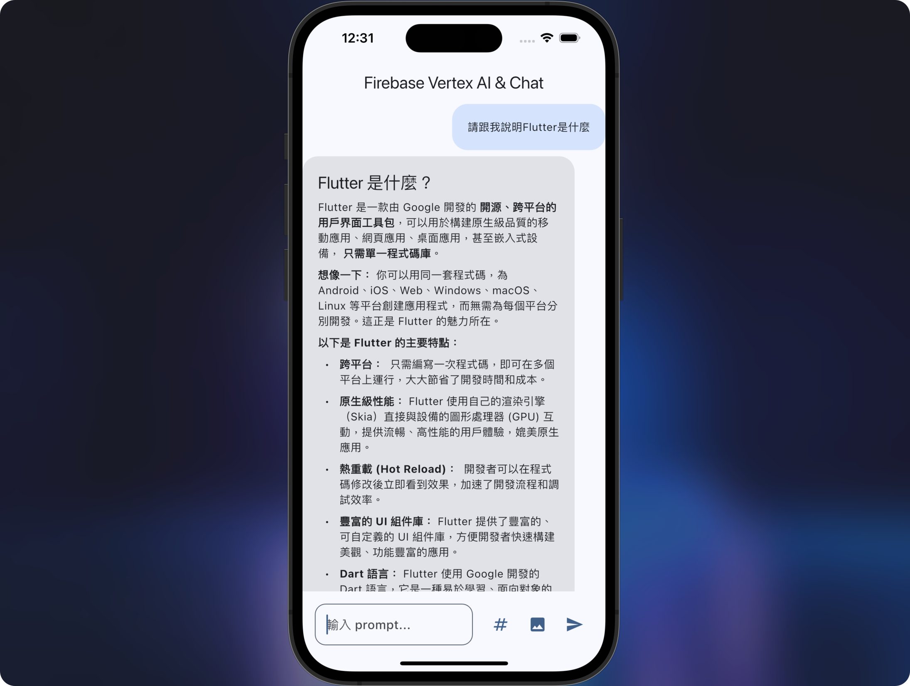

# Vertex AI Chat Example

[](README_zh.md)

A new Flutter project designed to demonstrate the integration of Vertex AI with a Flutter application. This project showcases various features and provides a solid foundation for building more complex applications.

## Introduction

Vertex AI is a powerful tool for building, deploying, and scaling machine learning models. This Flutter project aims to provide a practical example of how to integrate Vertex AI into a mobile application. By following this example, developers can learn how to leverage Vertex AI's capabilities to enhance their Flutter apps with machine learning features.

## Installation

1. **Clone the repository:**
   ```sh
   git clone https://github.com/your_username/vertex_ai_example.git
   cd vertex_ai_example
   ```

2. **Install dependencies:**
   ```sh
   flutter pub get
   ```

3. **Run the app:**
   ```sh
   flutter run
   ```

## Firebase Setup

1. **Install `flutterfire_cli`:**
   ```sh
   dart pub global activate flutterfire_cli
   ```

2. **Configure Firebase for your Flutter app:**
   ```sh
   flutterfire configure
   ```

   Follow the prompts to select your Firebase project and platforms (iOS, Android, etc.).

3. **Add Firebase dependencies:**
   Ensure you have the necessary Firebase dependencies in your `pubspec.yaml` file. For example:
   ```yaml
   dependencies:
     firebase_core: latest_version
     firebase_vertexai: latest_version
   ```

4. **Initialize Firebase in your Flutter app:**
   In your `main.dart` file, initialize Firebase before running the app:
   ```dart
   import 'package:firebase_core/firebase_core.dart';
   import 'package:flutter/material.dart';

   void main() async {
     WidgetsFlutterBinding.ensureInitialized();

     // 1.
     await Firebase.initializeApp();
     // 2.
     await Firebase.initializeApp(options: DefaultFirebaseOptions.currentPlatform)

     runApp(MyApp());
   }
   ```

## Use Cases

### 1. Text Prompt Response
In this scenario, the user inputs a text prompt and sends it to the AI. The AI then provides a response based on the given input. This can be used for various applications such as chatbots, virtual assistants, and more.

### 2. Image-Based Query
In addition to text prompts, users can also provide image inputs, either by taking a photo or selecting one from the gallery. Imagine taking a photo and asking the AI to identify the objects in the image. This use case is particularly useful for applications in image recognition, augmented reality, and more.

### 3. Token Usage Calculation
This scenario involves additional operations using Vertex AI to calculate token usage. The amount of tokens used represents the cost consumption and helps evaluate whether the current AI interactions are functioning properly. Monitoring token usage is a crucial indicator for managing costs and ensuring efficient AI operations.

## Screenshots




## Project Structure

- `lib/`: Contains the main code for the Flutter application.
  - `home_page.dart`: The main page of the application.

## Contributing

1. Fork the repository.
2. Create a new branch (`git checkout -b feature-branch`).
3. Make your changes.
4. Commit your changes (`git commit -m 'Add some feature'`).
5. Push to the branch (`git push origin feature-branch`).
6. Open a pull request.

## License

This project is licensed under the MIT License - see the [LICENSE](LICENSE) file for details.
